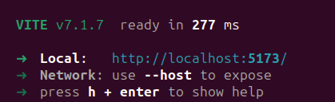

# A Simple React + Vite App

## Running the App

### Prerequisites
- [Node.js](https://nodejs.org/) (v24 or higher)
- [npm](https://www.npmjs.com/) (v10 or higher)

This section explains how to run the application locally.
### Steps

1. Check for Node.js & NPM
   ```cmd
   node -v
   npm -v
   ```
2. In your terminal, navigate to the project directory and install the project dependencies
   ```cmd
   cd react-app
   npm install
   ```
3. Spin up a development server via Vite
   ```cmd
   npm run dev
   ```
4. Access the app at the specified URL e.g., (http://localhost:5173)
   
   
